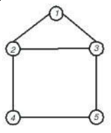

# [1198 - The Geodetic Set Problem](https://uva.onlinejudge.org/index.php?option=com_onlinejudge&Itemid=8&page=show_problem&problem=3639)

## Problem Description

Let G = (V, E) be a connected graph without loops and multiple edges, where V and E are the vertex
and edge, respectively, sets of G. For any two vertices u, v ∈ V , the distance between vertices u and v
in G is the number of edges in a shortest u − v path. A shortest path between u and v is called a u − v
geodesic. Let I(u, v) denote the set of vertices such that a vertex is in I(u, v) if and only if it is in some
u − v geodesic of G and, for a set S ⊆ V , I(S) = ∪ (u,v∈S) I(u, v), the union
of all the I(u,v) in S. A vertex set D in graph G is called a
geodetic set if I(D) = V . The geodetic set problem is to verify whether D is a geodetic set or not.

Figure 3: 


We use Figure 3 as an example. In Figure 3, I(2, 5) = {2, 3, 4, 5}
since there are two shortest paths between vertices 2 and 5. We can
see that vertices 3 and 4 are lying on one of these two shortest paths
respectively. However, I(2, 5) is not a geodetic set since I(2, 5) ̸= V .
Vertex set {1, 2, 3, 4, 5} is intuitively a geodetic set of G. Vertex set
D = {1, 2, 5} is also a geodetic set of G since vertex 3 (respectively,
vertex 4) is in the shortest path between vertices 1 and 5 (respectively,
vertices 2 and 5). Thus, I(D) = V . Besides, vertex sets {1, 3, 4} and
{1, 4, 5} are also geodetic sets. However, D = {3, 4, 5} is not a geodetic
set since vertex 1 is not in I(D).

### Input
The input file consists of a given graph and several test cases. The first
line contains an integer n indicating the number of vertices in the given graph, where 2 ≤ n ≤ 40. The
vertices of a graph are labeled from 1 to n. Each vertex has a distinct label. The following n lines
represent the adjacent vertices of vertex i, i = 1, 2, . . . , n. For example, the second line of the sample
input indicates that vertex 1 is adjacent with vertices 2 and 3. Note that any two integers in each line
are separated by at least one space. After these n lines, there is a line which contains the number of
test cases. Each test case is shown in one line and represents a given subset D of vertices. You have to
determine whether D is a geodetic set or not.


### Output
For each test case, output ‘yes’ in one line if it is a geodetic set or ‘no’ otherwise.

### Sample Input
```
5
2 3
1 3 4
1 2 5
2 5
3 4
6
1 2 3 4 5
1 2 5
2 4
1 3 4
1 4 5
3 4 5
```

### Sample Output
```
yes
yes
no
yes
yes
no
```

## Solving (first try)

Given a graph, and N sets of nodes, we need to answer for every set S if it 
conforms a geodesic set. That is to see, if every node in the graph is 
reachable given some pair (u,v)∈S, from u but using only the edges corresponding
to a shortest path from u to v.

We can note that the edges are unweighted and undirected. This implies a 
shortest path between u and v can be obtained running a BFS from u. 
BFS iterates through the "levels" of the tree that have u as root, and for
every level "d" it finds the nodes that are in it; that is to say, if a node v
is in the level "d" of the tree, it is a minimum distance "d" from u in the
original graph.

Given the graph (V,E), if we run a BFS from every node u, we can store the nodes
reachables in the path between v and every node u. So, we can have a matrix
```reachables[u][v] = list(nodes)```, storing for every pair of nodes (u,v) the nodes
that are reachables in the minimum paths between u and v. The first time we find
the node v from u, we can store the minimum distance, ```distance[u][v] = int```.

...

## Solving (second try)

#### Idea of the problem

Basically, we want to know, given a set of nodes S, if every node of the graph 
is inside a minimum path from some pair of nodes of these set. So, if we iterate
over every node in the graph, and for every one of them we ask the question
"is this node in some minimum path between some pair of nodes of S?", and for
all of them the answer is "yes", then  the answer to our problem will be "yes".
Otherwise, it will be "no".

#### How can we know if some node v is in some minimum path between some other two nodes? 

Let be distance(u,v) the length of the minimum path between the nodes u and v. 
Given a node v, and a pair of nodes s1, s2, we want to know if v is (or not) in some
minimum path from s1 to s2. 

- __If v is inside a minimum path between s1 and s2__: 
then the minimum path from s1 to v plus 
the minimum path from v to s2, is itself a minimum path 
from s1 to s2.
- __If v is not inside a minimum path between s1 and s2__: 
then the minimum path between s1 and v plus the
minimum path between v and s2 will form a path longer than the 
minimum between s1 and s2.

This is to say, v is inside a minimum path between s1 and s2 if and only if
**distance(s1,v) + distance(v,s2) = distance(s1,s2)**.

#### Coding the solution

We can use Floyd-Warshall Algorithm to obtain the distance between every pair
of nodes of the graph.
The result will be stored in a ```distances[u][v]``` matrix.

After that, we can define the answer to 
"is v in the minimum path between s1 and s2" as:
 
```python
def is_in_minimum_path(v, s1, s2):
    return distances[s1][v] + distances[v][s2] == distances[s1][s2]
```

Finally, the answer to the problem will be "yes" if every node gives true
to ```is_in_minimum_path``` for at least some pair of nodes inside S. 
Given that the graph is undirected, we can evaluate only the pairs (s1,s2)
that satisfies that s1<s2, because _path(s1,s2)=path(s2,s1)_. In this case,
n is small, so we don't need to worry about making more optimizations.
